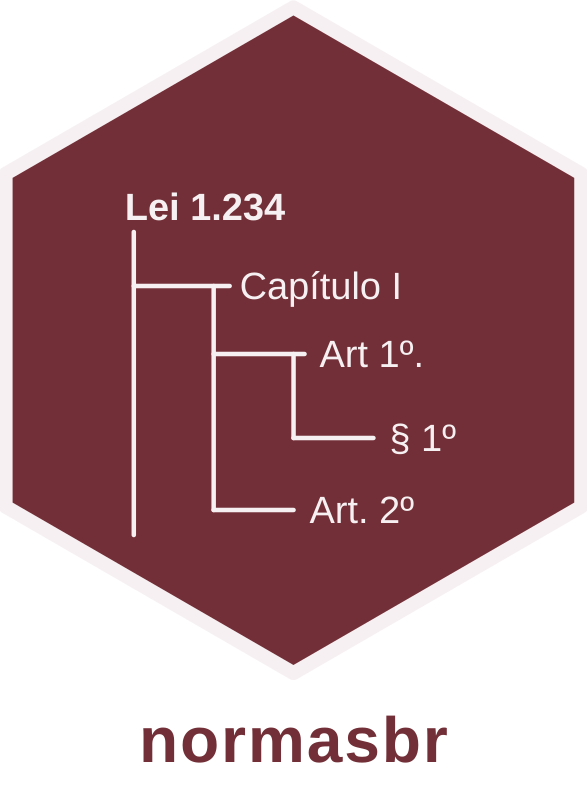

# normasbr 

[](./LICENSE)
[](./pyproject.toml)
[](https://github.com/astral-sh/ruff)
[](https://github.com/ipea/normasbr/actions)
[](https://pypi.org/project/normasbr)
[](https://pepy.tech/project/normasbr)
[](https://normasbr.readthedocs.io)

> ⚠️ **ATENÇÃO** ⚠️: Biblioteca ainda em estágio muito experimental, e sem garantias de retrocompatibilidade entre as versões.

**normasbr** é uma biblioteca Python que extrai, segmenta e estrutura normativas brasileiras (leis, decretos, portarias, instruções normativas, etc.)
a partir de HTML, PDF, DOCX ou TXT, convertendo textos brutos em documentos estruturados (YML), com a hierarquia completa de dispositivos
(norma > agrupadores > artigos > incisos > alíneas > itens).

O processamento é determinístico, usando heurísticas e expressões regulares baseadas em documentos normativos diversos.
A normativa estruturada permite uso facilitado nas mais diversas análises, como classificação e agrupamento de dispositivos, uso em sistemas de busca e RAGs e análise textual de normas.

## Pipeline

```
ingerir -> segmentar -> estruturar
```

1. **Ingestão**: normaliza HTML/PDF/DOCX/TXT para um HTML canônico;
2. **Segmentação**: extrai blocos de texto e classifica cada segmento
   (artigo, parágrafo, inciso, ementa, preâmbulo, bloco de alteração etc.);
3. **Estruturação**: monta a árvore hierárquica da normativa a partir dos segmentos;

Exemplo de resultado da estruturação:

```yaml
- classe: norma
  nome: LEI COMPLEMENTAR Nº 210, DE 25 DE NOVEMBRO DE 2024
  origem: data/novas/lei-complementar-210-2024.html
  ementa:
    - classe: ementa
      efetivo: true
      texto:
        Dispõe sobre a proposição e a execução de emendas parlamentares na lei
        orçamentária anual; e dá outras providências.
  preambulo:
    "O PRESIDENTE DA REPÚBLICA Faço saber que o Congresso Nacional decreta
    e eu sanciono a seguinte Lei Complementar:"
  filhos:
    - classe: agrupador
      tipo: capitulo
      id: CAPÍTULO I
      efetivo: true
      texto: DO OBJETO
      filhos:
        - classe: dispositivo
          tipo: artigo
          id: "1"
          efetivo: true
          texto:
            Art. 1º A proposição e a execução das emendas parlamentares à despesa,
            no âmbito da lei orçamentária anual da União, observarão o disposto nesta
            Lei Complementar, nos termos dos incisos I e III do § 9º do art. 165 da Constituição
            Federal.
          links:
            - texto: incisos I
              url: ../../Constituicao/Constituicao.htm#art165§9i
            - texto: III do § 9º do art. 165 da Constituição Federal.
              url: ../../Constituicao/Constituicao.htm#art165§9iii.0
          filhos:
            - classe: dispositivo
              tipo: paragrafo
              id: unico
              efetivo: true
              texto:
                Parágrafo único. O regramento disposto nesta Lei Complementar é imperativo
                para as leis orçamentárias previstas na Constituição Federal, bem como para
                a interpretação e a aplicação dos demais instrumentos normativos sobre a
                temática.
```

## Instalação

A última versão pode ser instalada com o [uv](https://docs.astral.sh/uv/):

```bash
uv add normasbr # Usando como biblioteca
uv tool install normasbr # Usando como utilitário de linha de comando
```

Ou diretamente do repositório:

```bash
uv pip install git+https://github.com/ipea/normasbr
```

## Exemplo de uso

### Biblioteca:

```python
import normasbr

for bruta in normasbr.despachar_ingestao("data/DEL5452.htm"):
    segmentos = normasbr.Segmentador().segmentar(normasbr.extrair_blocos(bruta))
    normas = normasbr.estruturar(segmentos, leniente=True)

print(normasbr.formatar_normativas_yml(normas))
```

### CLI:

```bash
normasbr ingerir data/DEL5452.htm
normasbr segmentar data/docs
normasbr estruturar data/docs -o normas.yml
normasbr diff_seg snapshot.jsonl novo.jsonl
normasbr classificar_macrodim normas.yml saida.parquet
```

## Ideias futuras

- [ ] Documentação da biblioteca;
- [ ] Simplificação de uso dos componentes da biblioteca;
- [ ] Melhorias nos tratamentos de preâmbulo e ementa;
- [ ] Melhorias no utilitário de classificação de normativas (ex: uso de cache e remoção da dependência do DuckDB);
- [ ] Rearquitetura das heurísticas para maior legibilidade e mantenabilidade;
- [ ] Reescrita dos trechos feitos por LLM;
- [ ] Criação de uma heurística para identificar anomalias e pontual a qualidade da estruturação;
- [ ] Melhorar identificação de normas sem efeito;
- [ ] Extração de normas dentro de anexos;
- [ ] Snapshot testing com um corpus diverso de normas;
- [ ] Identificação de referências;
- [ ] Ids/Hashes estruturais;

## Desenvolvimento

```bash
make setup   # cria o venv e instala as dependências
make check   # lint (ruff) + testes (pytest)
make format  # formata o código
```

## Referências usadas na modelagem

- [Glossário e técnica legislativa do Congresso Nacional](https://www.congressonacional.leg.br/legislacao-e-publicacoes/glossario-tecnica-legislativa)

## Nota <a href="https://www.ipea.gov.br"></a>

**normasbr** é desenvolvido por uma equipe de pesquisadores do Instituto de Pesquisa
Econômica Aplicada (Ipea).
